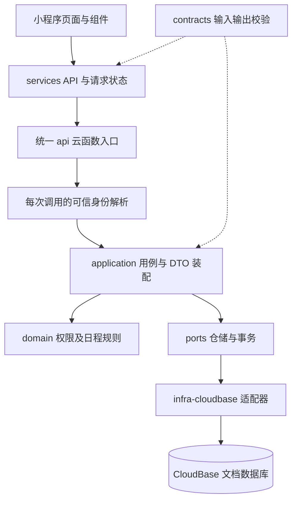

# 首版技术方案

状态：身份、个人与家庭协作已实现；周期、按人进度及批量追加已接入同一服务端。原生页面接入与实际部署边界见 [当前范围](SCOPE.md)、[家庭协作实现](technical/FAMILY.md) 和 [发布记录](technical/CLOUD_DEPLOYMENT.md)。下文保留首版完整设计；订阅消息和后台定时提醒尚未实现。

## 方案入口

| 内容 | 文档 |
| --- | --- |
| 实体、字段、存储索引、容量 | [数据模型](business/DATA_MODEL.md) |
| action、输入输出、错误码 | [API 契约](business/API.md) |
| 写入、权限交接、幂等、分页 | [一致性与数据访问](technical/CONSISTENCY.md) |
| 单次身份、片段、换人、暂停恢复 | [日程与记录算法](technical/SCHEDULING.md) |
| 页面状态、请求重试、缓存、提醒刷新 | [小程序实现方案](technical/CLIENT.md) |
| 重启后的未决操作与输入恢复 | [异常恢复](technical/RECOVERY.md) |
| 产品交互与路由 | [页面流程](business/INTERACTIONS.md) |
| 开发拆分、验证门槛 | [开发交付](business/DELIVERY.md) |

## 实施起点与改造方向（历史设计）

| 现有位置 | 现状 | 业务实现时的改造 |
| --- | --- | --- |
| `cloudfunctions/api/src/index.ts` | 模块级装配健康路由，导出 main | 保留健康分支；业务分支逐请求解析可信身份，再调用同一路由 |
| `packages/contracts/src/api.ts` | envelope、三个错误码、health 校验 | envelope 与各 action schema 分文件；请求/响应使用同一 ActionMap 推导 |
| `packages/application/src/router.ts` | context 只有 requestId | 增加服务端 Actor、Clock 时间与请求预算；不能从 payload 注入 |
| `packages/ports/src/platform.ts` | Clock、UuidGenerator | 加仓储、事务、身份映射、口令与游标端口 |
| `packages/domain/src/time.ts` | 仅 UTC 序列化 | 增加本地日期、日程投影、生命周期、纯权限规则 |
| `packages/infra-cloudbase/src/platform.ts` | 系统时钟、UUID | 增加服务端数据库适配与密码学实现 |
| `miniprogram/services` | 云 transport 和 health | 添加按功能 API、请求管理、初始化、提醒刷新；页面仍不直接用云 SDK |
| `tests/architecture.test.ts` / `build.test.ts` | 依赖方向和独立 bundle 校验 | 扩展业务模块边界；保留无 SDK 环境健康调用、客户端无 Node 依赖验证 |

现有 `system.health` 的输入 `{}`、输出 `apiVersion/service/status/now` 保持兼容，无需业务身份或数据库。它只说明入口和协议可用，不表示业务存储已就绪。

上述为接入业务前的起点。当前已实现身份、个人和家庭协作分层，实际文件与验证见 [家庭协作实现](technical/FAMILY.md)。

## 总体结构与依赖



图中的运行时调用经 ports 指向实现；源码依赖仍是 application → ports、infra → ports。domain/contracts 不相互依赖，ports 只引用 domain，不能引用公开 API DTO。application 负责将已校验 DTO 转换成 domain 值对象，再把领域结果转换为公开 DTO。

| 包 | 拟新增功能目录 / 文件 | 职责 |
| --- | --- | --- |
| contracts | `identity/ family/ task/ occurrence/ reminder/ progress/`，`action-map.ts` | 输入、输出、错误码、运行时校验；无 Node、平台 SDK、环境配置 |
| domain | `family/ task/ schedule/ policy/ reminder/` | 实体、不变量、状态转换、日期计算；函数显式接收 now |
| ports | `identity.ts`、`repositories.ts`、`unit-of-work.ts`、`query.ts`、`secrets.ts` | 按用例需要定义接口；不暴露 collection、where、SDK transaction |
| application | 同名功能目录、`command-runner.ts`、`query-runner.ts` | 鉴权、幂等、事务编排、DTO、稳定错误映射 |
| infra-cloudbase | `repositories/ mappers/ transaction/ identity/ crypto/` | 存储映射、事务、身份、UUIDv5、签名、认证加密 |
| api function | `index.ts`、`composition.ts`、`invocation-context.ts` | SDK 初始化、依赖装配、逐请求上下文；不放业务规则 |
| miniprogram | `services/`、`pages/`、`components/` | 原生页面与 API 适配，采用已有 tokens；全局仅保留必要会话状态 |

按功能逐个增加目录，不提前生成无内容的脚手架。领域返回判别联合的成功/拒绝结果，由 application 转换成 ApplicationError；基础设施异常在适配边界分类，错误不带 SDK 原文或身份信息。

## 契约与端口形状

继续手写窄范围运行时校验，不新增大型 schema 依赖。每个 action 有 input/output guard；仅编译期 ActionMap 不等于已经做运行时校验。envelope 拒绝未知顶层字段，action payload 拒绝未声明字段；字符串先按需求规范化，再计算幂等摘要。

建议的端口形状如下，是设计示例，不是已创建源码：

```ts
interface UnitOfWork {
  run<T>(work: (tx: TransactionContext) => Promise<T>): Promise<T>;
}
interface TransactionContext {
  families: FamilyRepository;
  tasks: TaskRepository;
  occurrences: OccurrenceRepository;
  preferences: ReminderPreferenceRepository;
  commands: CommandReceiptRepository;
  // 其余受本次事务约束的仓储同样从 tx 取得
}
interface TaskRepository {
  get(id: TaskId): Promise<Task | null>;
  insert(task: Task): Promise<void>;
  replace(task: Task, expectedVersion: number): Promise<void>;
}
```

事务回调只可用 tx 绑定的仓储；候选检索由单独 QueryReader 在事务外完成，再通过 scope revision 证明读到的候选在提交时仍有效。`replace` 不实现成“先查后写”的非事务版本检查。时钟、ID、SDK client 可复用；Actor、权限结果、事务及请求预算逐请求创建，不放模块全局。

## 身份与入口

1. 校验 envelope，提取合法 requestId；未知 action 仍返回 NOT_FOUND。
2. health 不初始化业务存储；其他 action 仅接受可信的小程序调用上下文，缺失或不符合调用来源要求则 UNAUTHENTICATED。
3. 每次调用读取受信任的 APPID/OPENID，验证 APPID 对应配置；客户端声称的 actorId/userId/role 一律无效。
4. identity.ensure 在事务中以 `(provider, appId, subject)` 的散列键取得或首次建立 Identity → User；首次名称为“我”，之后用户可以修改，不索取昵称头像才能使用。
5. 其他业务 action 必须已有应用身份。application 只拿应用 userId；OpenID 留在身份适配器内部。
6. 单元测试直接注入 Actor；真实业务验证必须从小程序发起，不能在控制台 event 中填写 OpenID 假装验证成功。

业务入口 `api` 只开放小程序调用，不配置 HTTP、Web、定时触发或转发代理。独立维护函数 `cleanup-query-sessions` 使用云端定时触发，客户端调用被函数安全规则禁止，见 [定时清理](technical/QUERY_SESSION_CLEANUP.md)。官方文档提醒混合调用可能受实例环境残留影响，因此“getWXContext 非空”不能单独作为来源校验。平台接入验证须证明非小程序调用不会继承前一请求的身份；不能证明时阻止业务发布并修正入口适配，不能退回信任 event。依据：[小程序调用云函数](https://docs.cloudbase.net/recipes/add-cloud-function-wechat-miniprogram)、[实例复用](https://docs.cloudbase.net/cloud-function/instance)。

## 技术决策

| 选择 | 原因及代价 |
| --- | --- |
| 一个 api，按 action 分发 | 延续现有基线，统一鉴权/错误/幂等；需要限制聚合和事务预算 |
| 文档存储与领域分离 | 现有 CloudBase 方向不变；实体不携带 SDK 类型 |
| 日程按需投影、记录稀疏持久化 | 无需定时任务，长期未打开也能回看；查询必须分窗口，不一次展开无限周期 |
| 当前事项 + 历史计划片段 | 改时间/换人不改历史；查询必须按片段而非当前事项计算 |
| 成员关系继承链交接 | 大量事项无需逐条原子转移；需要反向检索和版本栅栏，不能只按当前 owner 查 |
| 本人关闭提醒单独保存 | 避免管理者和重新共享绕过本人选择；权限和提醒意愿分别判断 |
| 写事务保存业务结果和幂等回执 | 丢响应后可确定重试结果；回执占存储，首版不自动清理 |
| 家庭单 scope 串行写 | 保证权限竞争正确；高频家庭可能冲突，记录证据后再细分锁粒度 |
| 分页会话保存扫描位置 | 无界历史不能塞进 2048 字符游标；增加内部短期数据及过期清理工作 |
| 页面局部状态、用户主动恢复 | 未决写按可信账号持久化，恢复后以原 ID 确认；不自动执行离线队列 |

## 运行时、构建与依赖

当前 `.nvmrc=20.19.0`、云配置 `Nodejs20.19`、函数 10 秒/256 MB；本次保留。官方配置仍列该运行时为推荐：[云函数配置](https://docs.cloudbase.net/cli-v1/functions/configs)。本地开发与发布检查使用 `.nvmrc`，根 engines 的较宽范围不表示已在全部版本验证。

平台实现使用 `wx-server-sdk` 作为微信云调用与数据库入口，不同时引入另一套独立 CloudBase 登录。已通过 npm 锁定 4.0.2，检查内置类型和事务实现；SDK 类型缺口在窄适配接口收敛，数据读取仍以 unknown 校验。已验证真实单账号事务、幂等和业务流程；间接依赖告警与多账号验证边界见发布记录。

保留 esbuild 自包含函数 bundle、`installDependency:false`。SDK 仅从云端装配路径引入；懒初始化业务依赖使 health 可在无云凭据/数据库下执行。已新增身份 SDK 独立加载测试；函数与共享契约体积随业务增长，最终产物及校验信息见发布记录。npm 已同步锁文件，真实云内 SDK 初始化和单账号业务写入已通过，详见发布记录。

小程序运行时代码仍从 `miniprogram/shared/contracts.js` 引用，不从 workspace 源码运行。随着 schema 增长，记录共享 bundle 体积；若确需拆分，构建产物仍全部位于小程序目录，类型检查与构建测试同步修改。

## 验证与发布边界

先完成平台接入验证：逐请求身份隔离、选定 SDK 的文档事务和冲突、打包独立加载、数据库仅服务端读写。官方事务文档给出单事务最多100操作、30秒、仅 doc 操作；项目使用更小的操作/时间预算，见 [一致性设计](technical/CONSISTENCY.md)。依据：[事务文档](https://docs.cloudbase.net/database/transaction)。

每个业务模块按契约 → 领域 → 用例 → 适配器 → 页面交付。正式契约/构建/业务代码变更运行 `npm run check`，另补真实 CloudBase 与多账号真机验收。单元 fake 不能替代事务/来源校验；已落地的43个 action 与真实验证边界见 API 和发布记录，尚未执行的技术目标不标记为已通过。

迁移在独立工具中执行；集合、索引与规则先验证，再上线相关 action。单个开发步骤不代表可以将缺少退出或撤权的家庭模型对外上线。生产提交、推送、部署与资源操作按当前会话另行授权。


### 列表精简表示（本地性能优化）

`task.list`（包括未安排）及 `task.recycleList` 支持可选 `view: "summary"`。
该表示的 `TaskSummaryDTO` 保留事项 ID、版本、标题、归属、当前对象、日程、生命周期与操作权限；省去备注、参与人列表、本人提醒偏好、创建/更新时间。
首页、批量选择与回收站只依赖这些摘要字段；编辑、详情和提醒设置通过 `task.get` 获取完整 `TaskDTO`。
不传 `view` 仍返回完整任务，详情及写接口不接受摘要代替完整 DTO；运行时列表校验兼容两种表示，游标指纹包含表示选项。
服务端需先发布再更新小程序；旧服务端会拒绝新增请求字段，回滚时需保留该字段兼容。真实部署状态仍以发布记录为准。

精简家庭列表只加载当前账号的历史可见权，不查询参与人的提醒偏好；输出前仍校验账号范围 revision、家庭版本与活跃成员资格。
周期列表在单次调用内按至多 20 个候选事项批量读取当前分段、当前账号的历史主体权限和提醒偏好；已命中与未命中结果都只保留于本次请求。当前分段在窗口内仅有一次投影时，跨事项批量读取稀疏状态和提醒回执；多次投影仍走原分段叠加路径，历史分段与控制的严格时间边界保持不变。提醒偏好使用只读批量端口，开始与最终账号、scope、家庭版本及成员身份校验仍保留；完整详情 DTO 仍在事务内读取。游标只持久化 ID 和不可变投影结果，续页重新加载有限批次，不使用跨请求缓存。

历史窗口跳跃和批量回执查询见 [日程存储约定](../database/recurrence.md) 与 [性能落地记录](technical/API_PERFORMANCE_IMPLEMENTATION.md)。

### 家庭必选创建

新建业务统一经 `CollaborativeTaskService` 校验 `draft.familyId`，无归属家庭且无既有回执时返回不可重试的 `VALIDATION_ERROR`，一次性和周期共用该限制。家庭成员资格仍在原业务事务内校验。旧回执优先保留幂等确认能力。契约中的可空家庭及内部个人服务保留，用于读取历史 DTO、恢复未决请求和迁移，不能据此认为线上新建允许个人事项。迁移状态与验证见 [家庭必选与历史迁移](technical/FAMILY_ONLY.md)。

日期范围/逾期待办 summary 与家庭进度的 occurrence 扫描使用独立 `TaskListSource = Omit<CollaborativeTask, "note">` 读模型；CloudBase inclusion `field` 在首扫、续页 ID 批量读取及不可变 run 的输出补读均移除备注，保留权限、历史片段、版本和真实排序游标字段。公共字段经同一校验器解析，完整实体仍另外要求有效 note，写入/详情接口不接受无备注模型。完整 DTO 请求复用本次已读取的完整实体，不增加补读；个人 summary 直接构建。`field` 由数据库观测包装原样转发，不计为数据库终端操作。此切片不覆盖无日期管理列表、未安排列表、回收站及提醒列表的事项读取；无需集合、索引或数据迁移，字节收益仅有本地模拟证据。

### 日期候选读取（默认关闭）

本地新增任务级 `candidateSchema/scopeKey/candidateKind/candidateOrder`，单次事项按日期索引缩小候选，周期或未知历史保守完整扫描。独立 candidateOrder 保留旧排序字段；分类随 task 原子写入且 history 不降级。默认 `FAMILY_TODO_INDEXED_CANDIDATES` 关闭，6个常量分支只接入普通日期范围 task.list；backlog 实验总成本增加，因此进度 progress.get（projectionOnly）、逾期/提醒保留旧路径，管理/回收站扫描及权限版本围栏不变。切换时 continuation 算法 fingerprint 不兼容而过期。索引、有限回填、覆盖率、完整流程成本和回滚门槛见 [任务候选存储约定](../database/task-candidates.md)。2026-09-17 已建索引并完成 31 条任务技术回填及完整复核；候选读开关仍关闭。

### 不可变次数排序续读（本地）

2026-09-16 本地实现将 occurrence 列表拆为 scan / merge / output 三个检查点阶段。小窗口不额外写 run；大窗口使用四路外部归并和每页 16 个描述符的不可变 manifest，最终游标只维护一个块 token 与 offset。反向归并并前插输出块，分轮切换方向，最终保证原比较器的升序；不修改源游标或已发布块。数据块同时限制 50 个 head / 64 KiB JSON UTF-8，检查点限制 96 KiB，存储保持 128 KiB 硬上限。输出推进发生在渲染成功后，身份、过滤指纹、asOf、作用域、过期和最终权限围栏均保留。历史窗口与 olderHint 跳跃逻辑不变，内部进度投影仍走原直接聚合路径。旧 occurrence 会话显式过期，不混用结构。

归并增加预处理读写及待清理块；它减少后续 P×R 重读，并非零成本排序。完整 50/200/1000 次本地曲线、清理成本假设及部署边界见 [性能落地记录](technical/API_PERFORMANCE_IMPLEMENTATION.md)。2026-09-17 已部署云端；未新增集合，候选索引与会话清理状态见成本优化验收。
