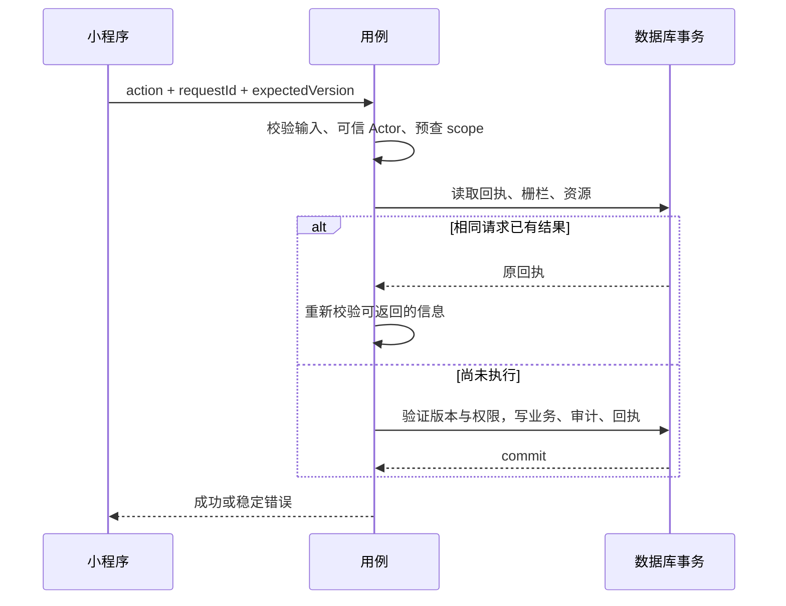

# 一致性与数据访问

本文件补充 [技术方案](../TECHNICAL_DESIGN.md) 的实现算法；字段与 action 分别以 [数据模型](../business/DATA_MODEL.md)、[API](../business/API.md) 为准。个人与家庭一次性协作的一致性实现已落地；周期、批量相关章节仍为设计，真实验证边界见 [发布记录](CLOUD_DEPLOYMENT.md)。

## 存储键与版本

实体 ID 仍为应用 UUID；以下技术文档键由适配层生成，不返回客户端：

| 数据 | 定位键 / 作用 |
| --- | --- |
| 身份 | hash(provider, appId, subject)，事务避免重复建用户 |
| 当前成员槽 | hash(familyId, userId)，最多一条 activeMembershipId |
| 提醒偏好 | hash(taskId, userId)，退出再加入仍保留 selfDisabled |
| 单次状态 | 确定性 occurrenceId，未记录时为投影 pending/version=0 |
| 单次提醒回执 | hash(occurrenceId, userId)，用户互不影响 |
| 幂等结果 | hash(actorUserId, requestId)，同时保存原组合用于一致性检查 |
| 批量子结果 | hash(actorUserId, requestId, taskId)，子事务原子保存 |
| 用户容量与版本 | userId，维护 activeFamilyCount/personalTaskCount 与 revision |
| 查询会话 | 随机 UUID，绑定 actor、筛选、asOf、scope revisions 和扫描位置 |

revision 与公开编辑 version 分工：Family.version 作为家庭写栅栏；authEpoch 在成员/权限变化时递增；UserScope.revision 用于个人数据与家庭名单变化的查询失效。Task.version 校验内容与管理设置；Occurrence.version 校验单次记录。修改单次还须递增 Task.version，以保护“只有未完成才能改期”的并发检查；提醒已读/收起回执不改 Task.version，但更新所在 scope revision。这里 Family.version 可因同家庭任意写而变化，预览/游标失效属于明确的首版取舍。

所有可影响个人查询的写均更新 UserScope.revision；加入/退出更新用户的家庭计数与 revision，家庭集合变动不能只检查旧家庭列表。技术集合仅服务端访问。

## 单项写入协议

执行顺序：

1. 完成结构校验、规范化和 canonical payload hash。预算从入口开始计算，不从事务开始重置。
2. 先按可信 Actor/requestId 查询已有回执，匹配 action/hash；退出/转交，以及已提交 task.update 导致操作者失权后的最小回执可直接返回，不能先要求当前家庭访问权。普通结果仍走当前鉴权，查询的回执不可变且不得在此重复执行业务。未命中时根据 Actor 取得个人或家庭 scope。可能很长的归属/管理链、片段候选在事务外分页读取，前后 scope revision 一致才组成快照。
3. 开始事务；按确定顺序读取回执、scope guard、Task、当前成员、操作所需状态，验证预读快照 revision 与事务内一致。
4. 有同 ID 回执且 action/hash 不同则 IDEMPOTENCY_CONFLICT；相同则返回结果，不重新执行业务。
5. 校验当前权限、expectedVersion、生命周期、容量和提醒 selfDisabled。业务冲突不自动改版本重试。
6. 在事务内写业务、scope guard、相关版本、追加审计、幂等回执；一次提交。未提交不得返回成功。
7. SDK 可明确识别的事务冲突允许最多重试 2 次且受总预算约束，每次重新读取快照；ID/请求语义不变，逻辑操作时间以最终成功尝试的服务端时间为准。无法判断是否提交的错误先回查回执，不能盲目生成新请求。

identity.ensure 是身份引导例外：在尚无应用 Actor 时按可信平台身份定位映射，用映射唯一键在同一事务内创建或读取 User/UserScope，不先要求 userId；幂等收据使用最终解析的 userId。重复 ensure 返回同一个用户身份。

纯校验失败无需永久保存幂等行；已提交业务的结果必须持久化。需要 requestId 绑定预生成资源 ID 时，可由服务端 keyed hash/确定性 UUID 派生，或由成功事务一次保存；不依赖进程变量保证跨实例一致。

## 按操作划分事务

下表为最坏情况的设计估计，读写分别计数；实施时计数器校验≤80，并以真实 SDK 验证。预算超出则拆成可证明原子的模型，不拆成用户可见的半成功权限更新。

| 操作 | 事务内主要对象 | 估计操作数 |
| --- | --- | --- |
| identity.ensure | identity、user、user scope、结果回执 | ≤12 |
| family.create / invitation.accept | user scope、family、slot、member、invite、事件、回执 | ≤20 |
| task.create | guard、actor/member、subject、task、segment、最多20偏好、事件、回执 | ≤60 |
| task.setAccess / update | guard、task、成员快照、最多20偏好读写、必要片段、事件、回执 | ≤75 |
| occurrence.record / undo | guard、task、片段/控制快照校验、occurrence、事件、回执 | ≤20 |
| family.exit | family、target/user scope、slot、接收关系、事件、回执 | ≤25；不逐条更新 task |
| transferOwnership | family、双方成员、事件、回执 | ≤15 |
| 单个批量项 | 一项 task 与归属/权限、子回执 | ≤75；各项独立 |

成员、片段或控制记录不能无界塞入事务；事务外快照必须覆盖权限判断所用的全部信息且使用相同 scope 写栅栏。取消可见不强制逐条删除无限历史回执，只在当前鉴权中让其失效。任务审计与家庭审计分开存储：TaskEvent 与 FamilyEvent，均不可由客户端改写。

## 退出与拥有权转交

退出的原子结果是修改成员关系，不是逐个移动事项。目标 membership 变为 left/removed，其 successor 指向当时有效拥有人；slot 清空，目标用户 scope 计数减少，family version/authEpoch 增加，事务保存家庭审计和退出回执。

读取普通 ownerBinding 或失效创建者管理职责时，沿 successor 到 active membership；虚拟事项当前归属直接读取 family.ownerMembershipId。保留旧 membership 及历史称呼，重新加入生成新 membership。

为列出承接项，从当前成员反向遍历 `familyId/successorMembershipId` 索引，收集其祖先 membershipId，再查 ownerBinding/creatorMembershipId 候选；和直接可见候选去重。不能只解析“已查到的任务”，否则完全漏掉未检索的承接任务。遍历有环报数据异常，不把固定深度当业务终点；跨请求按查询会话保存扫描位置。

同一家庭所有链变动持有 family 写栅栏，所以事务外解析后可在小事务中复查版本。预算不足返回可重试失败，不执行半次交接。预览在完整扫描前不能提交计数为零；预览响应增加扫描状态，完成后才签发5分钟 previewToken。

转交不自动退出；当前虚拟归属随 ownerMembershipId 生效，原拥有人仍为有效创建者的权限依原规则保留。退出预览和提交是独立操作，若期间 family 变化则 PREVIEW_EXPIRED。

**响应丢失后的失权例外**：退出成功后原操作者已无家庭访问权，重试必须能确认自己刚完成的退出。原 actor/requestId/hash 匹配时只返回其操作回执中的最小退出确认，不返回家庭/成员/事项 DTO；从回执中移除 successor 的敏感详情。转交后原操作者可能不再有管理权，同样只返回 API 定义的最小成功确认；其他业务 DTO 重放仍须当前鉴权。此例外不授予退出后查询家庭的能力。

## 日程更新与完成的竞争

单次首次记录事务以 occurrenceId/version=0 插入；两个客户端同时完成只允许一个提交，另一个获得 VERSION_CONFLICT。相同 requestId 是重试，返回第一次结果；不同 requestId 是独立命令，不伪装重复成功。

完成/撤销同时更新 Task.version，因此“读取未完成 → 改日期”和“完成”不能都依据旧 Task 状态成功。取消权限、暂停、删除与完成也通过相同 scope 栅栏串行化；后提交者重新鉴权及验证单次是否仍存在，不只校验 occurrence version。

本人 setMine(false) 同时置 selfDisabled、更新 preference/task/scope；管理者保存必须读取该值并检查 Task.version，不能覆盖本人刚关闭的状态。旧请求重试只返回旧回执，不重演旧的开启写入。

## 批量操作与时间预算

当前云函数超时10秒；设置应用处理预算8秒，预留序列化及回包余量。事务启动前至少剩余2秒；接近预算停止启动新项。客户端10秒超时代表结果未知，不是服务端已取消。

批量最大20项，不假设20个事务能在一次调用完成。外层命令记录固定 items/hash 与状态 running/completed；子项各自在业务事务中保存结果。可在同一调用顺序处理，剩余预算不足时返回 `complete=false` 及各项 `succeeded/failed/pending`。客户端沿用原 requestId 和原完整 payload 继续，已完成子项只读回执。

`pending` 不是失败；只有拿到 `complete=true` 后，用户才可选失败项，用新 requestId 和最新版本重试。没有后台自动执行或定时任务，页面离开时剩余项目保持待继续。相同命令并发继续由子回执唯一键防重，外层完成状态由持久化子结果计算，不能覆盖别的 worker 已完成项。单项明确失败也以独立小事务保存终态子回执；连接中断/提交未知保持 pending，先查回执再决定继续。结果重放重新鉴权，已失权项只返回 NOT_FOUND，不重新执行原已成功操作。

## 查询、排序与分页

首版允许每家庭最多500个未删除事项，但历史、停用成员和日程片段不据此截断。读取采用有界扫描，而非全量数据进入一次函数。

- 每个查询会话固定 actor、action/filterHash、asOf、家庭名单 revision、各 scope revision。游标只带签名后的会话ID、检查点ID、有效期；不把全部权限或任务 ID 塞入游标。
- 查询会话拆成不可变检查点文档，每个文档序列化≤128 KiB，只存扫描位置、聚合计数及有限缓冲，不保存无限结果。缓冲溢出拆成按序编号的检查点分片，主检查点只存分片范围和消费位置；所有分片持久化后才发布该检查点。未发布分片可随会话过期清理。一次读取同样受计算预算约束，不能通过单个无限 manifest 绕过文档上限。有效15分钟，读写时检查过期；运维迁移工具可清理过期会话，不依赖定时清理才能正确运行。
- 每次最多读取200个候选事项、投影2000个次数，或工作预算8秒，先到即暂停。这是每次计算上限，不是用户数据上限；返回 continuation，不丢剩余记录。
- 每 scope 产生有序记录流，用相同排序键合并。只有所有未结束流都已提供下一候选或足够的下界，才能输出全局最小项；若证据不足允许 `items=[]/complete=false`，继续扫描。不能先返回局部最早项，再在下一页插入更早数据。
- 全量摘要仅在整个筛选扫描完成且所有 scope revision 仍一致时返回；否则 summary=null。分页累积计数按 occurrenceId 去重。某 scope 失败显示受影响范围，结果不声称完整有序总集；恢复后重新查询，避免和旧部分结果直接拼接。
- 本次查询前后复查 scope 版本及用户家庭列表 revision；变化时会话失效，返回 CURSOR_EXPIRED。个人/家庭已失权时不重放已缓存的结果；缓存只加速扫描，不能替代鉴权。
- 对过去未完成/提醒，从今天向前按31天窗口扫描，窗口内按文档排序；接口显式声明“最近窗口优先，窗口内升序”，不与普通日期列表的全局升序混用。

每页取20/50不等于只查20/50候选。过滤后空页可能只是尚未找到有权记录，需要 continuation；“无事项”只能在 complete=true 时成立。未删除事项额度不限制回收数量，回收必须独立分页。

## 性能与可观察性

结构化记录 requestId、action、耗时、候选数、投影数、文档读写数、冲突重试数、scope失败数；不记录正文、成员称呼、OpenID、邀请口令、加密密钥或完整 payload。客户端只看到稳定错误。

首次结果p95≤2秒、完整摘要目标≤5秒是待测目标。500事项×31天×6时刻为单家庭最多93000个候选次数，10家庭可达930000；因此不能承诺所有密集历史在5秒完成。验证分别测常见活跃日、31天密集周期、长期积压和成员长链；超时继续加载并显示未完成统计。用户数据不因性能目标被删除或漏算。

迁移工具先创建 guard、业务集合、索引、服务端权限规则；在没有业务数据时建立 schemaVersion=1。按环境保存 migration journal 与校验摘要；查询会话清理只删除 expiresAt 已过的技术记录，幂等与审计不在清理范围。实际资源操作另行授权。
